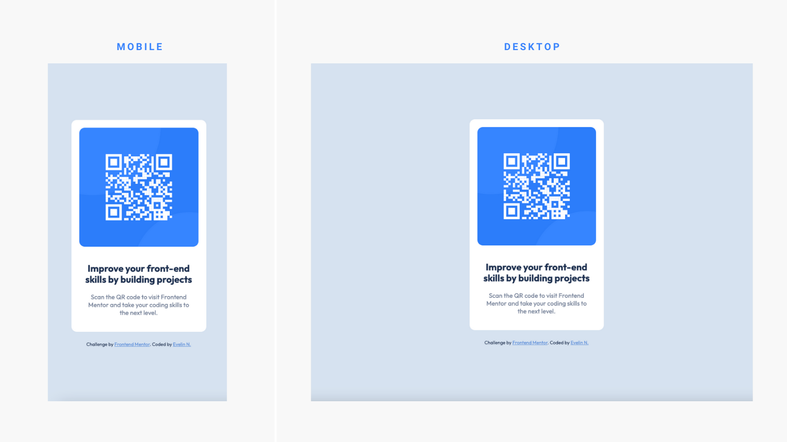

# Frontend Mentor - QR code component solution

This is a solution to the [QR code component challenge on Frontend Mentor](https://www.frontendmentor.io/challenges/qr-code-component-iux_sIO_H). Frontend Mentor challenges help you improve your coding skills by building realistic projects.

### Screenshot

### Links

- Live Site URL: [https://dev-evelin-qrcodecomponent.netlify.app/](https://your-live-site-url.com)

### Built with

- Semantic HTML5 markup
- CSS custom properties
- Flexbox
- CSS Grid
- Mobile-first workflow

## Author

- Frontend Mentor - [@dev-evelin](https://www.frontendmentor.io/profile/dev-evelin)
- Twitter - [@dev*evelin*](https://twitter.com/dev_evelin_)
